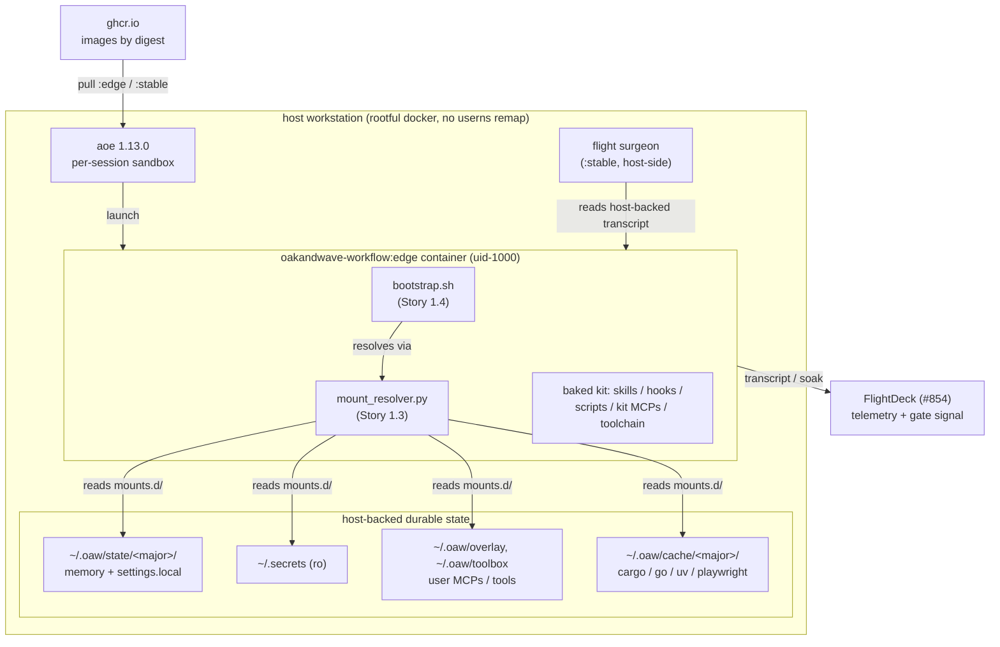
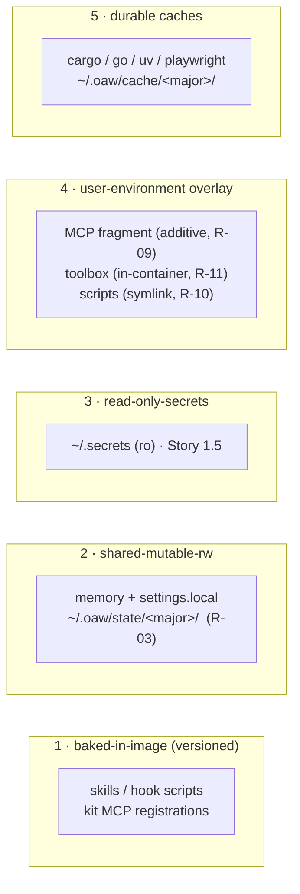

# Architecture — contained workflow

Deliverable **DM-11** (Plan #959, Dev Spec §5.A). Trigger: the system has more
than two interacting components. This document is the component-level map; the
authoritative requirement/design source is
[`docs/contained-workflow-devspec.md`](../contained-workflow-devspec.md) and its
design rationale is `docs/contained-workflow-SKETCHBOOK.md` (merged #958). Where
this doc and the Dev Spec differ, the Dev Spec governs.

## 1. What this system is

The OaW Claude Code kit, packaged as a **versioned container image**
(`oakandwave-workflow:<semver>`) on the AoE sandbox base, so the **image digest
*is* the release** (R-05). The container is a **stateless, disposable RTE**: all
durable state lives on host-backed mounts (R-01), so a broken candidate is
`docker rm`, not an incident. The OaW dev team runs these containers (the
*dogfood ring*) to prove a candidate before the wider fleet adopts the promoted
`:stable` digest.

The design exists to install a boundary that was missing: previously every agent
read one shared `~/.claude`, so one break blocked the whole fleet and a kit could
not be tested without mutating live state (Dev Spec §1.2).

## 2. Component map



**Interacting components** (the >2 that trigger this doc):

| Component | Role | Owner story |
|-----------|------|-------------|
| The image (`Dockerfile` + `Makefile`) | Bakes the kit + toolchain; the digest is the release | 1.1 (#961) |
| me-ful sandbox profile (`sandbox-profile.toml`) | Launches the image as uid-1000 so bind-mount writes are host-owned | 1.2 (#962) |
| **Mount manifest + resolver (`mounts.d/`, `mount_resolver.py`)** | **Declares + resolves the run-layer mounts; enforces the state-taxonomy guards** | **1.3 (#963)** |
| Bootstrap (`bootstrap.sh`) | Runs before the agent: skills-sync, settings merge, secret sourcing, env validation | 1.4 (#964) |
| Secrets mount | ro `~/.secrets` dir mount with mid-session liveness | 1.5 (#965) |
| CI build/push + throwaway-CI ring | Builds, signs, SBOMs, pushes by digest; smokes install-from-zero | 2.1/2.2 |
| Promotion gate | Mechanical conjunction over FlightDeck + CI; retags the tested digest | 2.3 |
| Flight surgeon | Host-side probe reading the host-backed transcript; quarantine + rollback | 3.1/3.2 |

## 3. The mount manifest (Story 1.3, this story)

Every piece of `~/.claude` state files onto one of the **five layers** of the
state taxonomy (Dev Spec §5.3), and the layer decides how it enters the
container. Layer 1 is *baked in the image* (not a run mount); the other four are
run-layer bind-mounts declared in
[`containers/oakandwave-workflow/mounts.d/`](../../containers/oakandwave-workflow/mounts.d/)
and materialized by
[`mount_resolver.py`](../../containers/oakandwave-workflow/mount_resolver.py).



### 3.1 Layers and their mechanisms

| Layer | Mechanism | Manifest fragment | Requirements |
|-------|-----------|-------------------|--------------|
| Baked-in-image | Built by `./install` in the image; immutable per tag | *(none — in the image)* | R-06, R-09 |
| Shared-mutable-rw | rw bind-mount, **sandbox-scoped** host source | `10-memory.toml` | R-03, R-20 |
| Read-only secrets | ro bind-mount of the `~/.secrets` dir | `20-secrets.toml` *(Story 1.5)* | R-12, R-13 |
| User-environment overlay | additive / in-container / symlink, by artifact type | `30-user-overlay.toml` | R-09, R-10, R-11 |
| Durable caches | rw bind-mount, major-partitioned | `40-durable-caches.toml` | §5.3 |

### 3.2 The resolver and its guards

`mount_resolver.py` loads the `mounts.d/*.toml` fragments (lexical order),
substitutes `<major>` and `~`, applies the guards, and emits `docker -v` /
aoe `extra_volumes` / JSON for the bootstrap:

```bash
python3 containers/oakandwave-workflow/mount_resolver.py --major 8 --format aoe
```

Each guard **fails loud** — a manifest violation raises `ManifestError`, never
degrades silently (the D7 assertion-liveness discipline):

- **R-03 — sandbox-scoped memory.** The one rw seam into shared durable state
  (memory) must resolve under `~/.oaw/state/<major>/` and must **never** touch
  the live-fleet `~/.claude` tree. Pointing it at `~/.claude/projects/*/memory`
  would hand a broken `:edge` candidate write access to the live fleet's memory —
  the exact shared-mutable-with-live-fleet disease this design cures, at the one
  rw seam. The `<major>` segment partitions the namespace so mixing majors is
  isolated, not corrupting (R-20). This is the story's canonical oracle
  (`test_memory_source_scoped`).
- **R-10 — the libc boundary.** A compiled binary in the user overlay is
  installed *in* the container (`install = "in-container"`), never symlinked
  across the host/container libc boundary — a host ELF fails on `.so`/interpreter
  mismatch in a differently-built container. Scripts and config may symlink. The
  resolver rejects a `compiled-binary` declared `symlink`; the `is_compiled_binary`
  file classifier (ELF magic vs `#!` shebang) is the runtime primitive the
  bootstrap uses to route each `~/.local/bin` entry (measured: ~154 shebang
  scripts symlink-safe, ~26 ELF must install in-container).
- **R-09 / R-11 — additive composition.** Third-party / user MCP servers compose
  as an *additive fragment* (`compose = "additive"`) via the scoping already
  governed by [`docs/mcp-scoping.md`](../mcp-scoping.md) — never by mounting the
  whole `~/.claude.json` (which carries far more than MCP config). The kit's own
  MCP registrations (`disc-server`, `sdlc-server`, `wtf-server`, `nerf-server`,
  `discord-watcher` — see `mcps.json`) are **baked at stable image paths**;
  baking kills the dangling-registration bug (a stale path to a moved binary).
  The discretionary-tool toolbox (R-11) is a durable, in-container-materialized
  mount decoupled from the kit release.

### 3.3 settings.json split

`settings.json` straddles versioned and shared, so it is **split** (Dev Spec
§5.3): the image ships `settings.json` (hook wiring — versioned, because hook
registrations point at script paths that live in the image), and the
`10-memory.toml` fragment bind-mounts `settings.local.json` (permissions / env /
identity — the genuinely shared knobs). Claude Code merges the two.

### 3.4 PATH precedence

Kit binaries (from the image) win over the user overlay on `PATH`, so the RTE
stays authoritative — the same digest-determines-behavior rule that the promotion
gate depends on (Dev Spec §5.3).

## 4. Boundaries and invariants

- **Stateless-container invariant (R-01/R-02).** The container filesystem is
  disposable; everything durable is a host-backed mount, so recreate loses no
  state. The resolver's job is to make every durable mount explicit and guarded.
- **me-ful ownership (R-04).** The container runs as uid-1000 `ubuntu`, so
  bind-mount writes land host-user-owned (`bakerb`). Delivered by the image
  `USER` (Story 1.1) + the isolated aoe profile (Story 1.2).
- **Portability (PC-3).** No OaW-org specifics (cephfs paths, secret contents)
  are baked into the image; org infrastructure is a run-layer overlay only. The
  manifest's host sources are the run-layer seam.
- **Major-partitioned namespace (R-20).** `~/.oaw/state/<major>/` and
  `~/.oaw/cache/<major>/` are keyed by kit major, so mixing majors is isolated,
  not corrupting — the SemVer compatibility contract (Dev Spec §5.8).

## 5. Open items carried by this component

- **Isolation under the full custom mount set** (Dev Spec §5.N#3, MV-02): the
  "live `~/.claude` is not exposed" result was one default-`--sandbox`
  observation; it is confirmed against the full manifest in MV-02 (closing story
  4.3). The resolver's R-03 guard is the *static* half of that assurance; MV-02
  is the runtime half.
- **Secrets blast-radius** (Dev Spec §5.5, §5.N): the whole-`~/.secrets`-dir
  mount means every ring sees every secret, including across the GitLab/GitHub IP
  boundary. Least-privilege scoping is an open design item; the manifest's
  `read-only-secrets` layer is where a future scoped-secrets mechanism slots in.
- **AoE bootstrap seam** (Dev Spec §5.N#5): whether aoe respects the image
  `ENTRYPOINT` or `docker exec`s the agent directly determines where the
  bootstrap (Story 1.4) hooks the resolver in. The resolver is seam-agnostic — it
  is a pure function from `(manifest, major, home)` to a mount set.

## 6. Verification

| Requirement | Verified by |
|-------------|-------------|
| R-03 sandbox-scoped memory | `tests/contained-workflow/test_mounts.py::test_memory_source_scoped`; IT-03; MV-02 |
| R-09 MCP additive scoping | `test_mounts.py::test_mcp_composes_additively`; IT-03 |
| R-10 binaries in-container | `test_mounts.py::test_compiled_binary_installs_in_container`; IT-01/IT-03 |
| R-11 declarative toolbox | `test_mounts.py::test_toolbox_is_durable_in_container`; IT-03 |
| R-01 stateless / host-backed | this doc (DM-11); IT-03; MV-02 |
