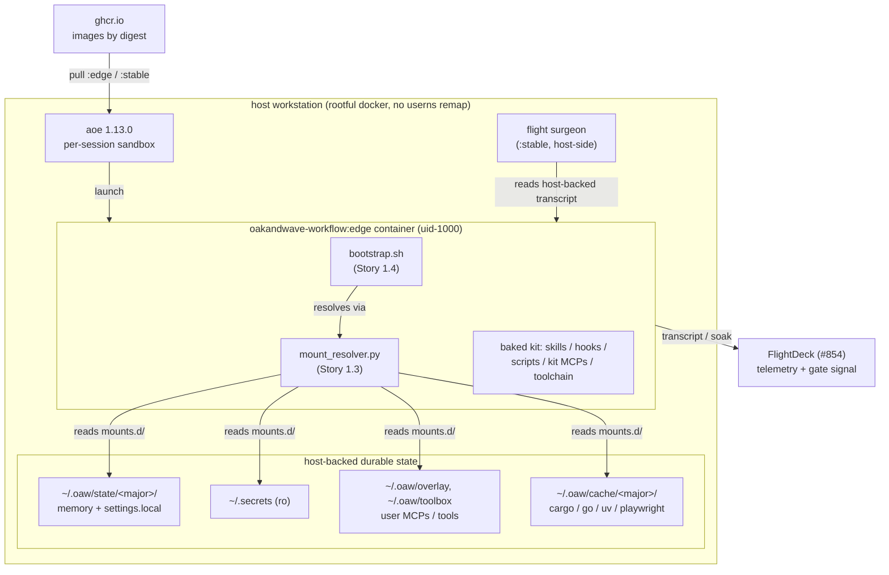
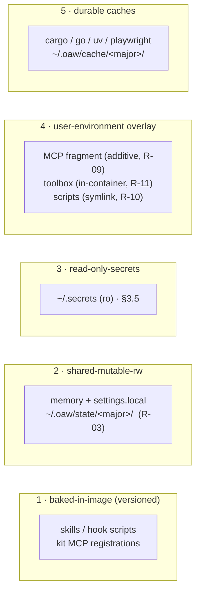

# Architecture — contained workflow

Deliverable **DM-11** (Plan #959, Dev Spec §5.A). Trigger: the system has more
than two interacting components. This document is the component-level map; the
authoritative requirement/design source is
[`docs/contained-workflow-devspec.md`](../contained-workflow-devspec.md) and its
design rationale is `docs/contained-workflow-SKETCHBOOK.md` (merged #958). Where
this doc and the Dev Spec differ, the Dev Spec governs.

## 1. What this system is

The OaW Claude Code kit, packaged as a **versioned container image**
(`oakandwave-workflow:<semver>`) on the AoE sandbox base, so the **image digest
*is* the release** (R-05). The container is a **stateless, disposable RTE**: all
durable state lives on host-backed mounts (R-01), so a broken candidate is
`docker rm`, not an incident. The OaW dev team runs these containers (the
*dogfood ring*) to prove a candidate before the wider fleet adopts the promoted
`:stable` digest.

The design exists to install a boundary that was missing: previously every agent
read one shared `~/.claude`, so one break blocked the whole fleet and a kit could
not be tested without mutating live state (Dev Spec §1.2).

## 2. Component map



**Interacting components** (the >2 that trigger this doc):

| Component | Role | Owner story |
|-----------|------|-------------|
| The image (`Dockerfile` + `Makefile`) | Bakes the kit + toolchain; the digest is the release | 1.1 (#961) |
| me-ful sandbox profile (`sandbox-profile.toml`) | Launches the image as uid-1000 so bind-mount writes are host-owned | 1.2 (#962) |
| **Mount manifest + resolver (`mounts.d/`, `mount_resolver.py`)** | **Declares + resolves the run-layer mounts; enforces the state-taxonomy guards** | **1.3 (#963)** |
| Bootstrap (`bootstrap.sh`) | Runs before the agent: skills-sync, settings merge, secret sourcing, env validation | 1.4 (#964) |
| Secrets mount | ro `~/.secrets` dir mount with mid-session liveness | 1.5 (#965) |
| CI build/push + throwaway-CI ring | Builds, signs, SBOMs, pushes by digest; smokes install-from-zero | 2.1/2.2 |
| Promotion gate | Mechanical conjunction over FlightDeck + CI; retags the tested digest | 2.3 |
| Flight surgeon | Host-side probe reading the host-backed transcript; quarantine + rollback | 3.1/3.2 |
| Container profiles (`profiles.py`) | The two rings + the `oaw.profile` label; the gate-side telemetry filter | 4.1 (#974) |

### 2.1 Container profiles (Story 4.1, R-21/R-22)

The candidate runs in one of **two profiles**, distinguished by the `oaw.profile`
docker label the surgeon and the promotion gate both read:

| Profile | Skills overlay | `oaw.profile` | Candidate? | Role |
|---------|----------------|---------------|------------|------|
| **dogfood** | OFF — image-only | `dogfood` | yes | The real dogfood ring: its runs accrue soak and its breakages trip quarantine — it is what the gate measures. |
| **dev-mode** | ON — a whole-directory bind of the developer's working skills **over** the image skills dir (the R-06 non-promotable exception) | `dev-mode` | **no** | Skill iteration without a rebuild. **Excluded from promotion telemetry** — dev-mode runs/breakages never count toward soak nor trip quarantine. |

> **The overlay REPLACES, it does not merge (#1067).** The bind covers the whole
> image skills dir, so the container sees exactly what the host source contains.
> An empty source therefore yields a container with **no skills at all**, silently —
> `profiles.py` refuses that launch rather than rendering it. Note this is a
> *different* mechanism from `bootstrap.sh`'s skills-sync, which is **image-wins /
> host-fills** from `~/.oaw/.claude/skills`. Two overlay paths with two semantics;
> reconciling them is open work.

`containers/oakandwave-workflow/profiles.py` is the canonical owner of the label
and the candidacy rule. It renders each profile's launch (`launch_spec` — the
`oaw.profile` label plus, for dev-mode only, the skills-overlay `-v` bind, so
"overlay ON" is a real mount and "overlay OFF" its absence), and provides the
**gate-side filter** (`aggregate_gate_signals`) that folds the soak/quarantine
ledgers into `SOAK_HOURS` / `QUARANTINE_COUNT` with every dev-mode record dropped.
The **probe half** of the same filter lives in the flight surgeon
(`scripts/flight-surgeon/surgeon.py`), which excludes dev-mode from
`should_quarantine`; the surgeon re-states the alias table rather than importing
`profiles.py` because it must depend on only the standard library (R-15), and a
lock-step test keeps the two in agreement. The promote wrapper
(`scripts/ci/promote-oakandwave-image.sh`) defaults its `GATE_SIGNALS_CMD` to this
filter when `OAW_SOAK_LEDGER` / `OAW_QUARANTINE_LEDGER` are supplied — so the gate
filters on the label end-to-end.

## 3. The mount manifest (Story 1.3, this story)

Every piece of `~/.claude` state files onto one of the **five layers** of the
state taxonomy (Dev Spec §5.3), and the layer decides how it enters the
container. Layer 1 is *baked in the image* (not a run mount); the other four are
run-layer bind-mounts declared in
[`containers/oakandwave-workflow/mounts.d/`](../../containers/oakandwave-workflow/mounts.d/)
and materialized by
[`mount_resolver.py`](../../containers/oakandwave-workflow/mount_resolver.py).



### 3.1 Layers and their mechanisms

| Layer | Mechanism | Manifest fragment | Requirements |
|-------|-----------|-------------------|--------------|
| Baked-in-image | Built by `./install` in the image; immutable per tag | *(none — in the image)* | R-06, R-09 |
| Shared-mutable-rw | rw bind-mount, **sandbox-scoped** host source | `05-transcripts.toml`, `10-memory.toml` | R-03, R-20 |
| Read-only secrets | ro **named single-file** bind-mounts under `~/.secrets` (§3.5) | `20-secrets.toml` | R-12, R-13, R-14 |
| User-environment overlay | additive / in-container / symlink, by artifact type | `30-user-overlay.toml` | R-09, R-10, R-11 |
| Durable caches | rw bind-mount, major-partitioned | `40-durable-caches.toml` | §5.3 |

### 3.2 The resolver and its guards

`mount_resolver.py` loads the `mounts.d/*.toml` fragments (lexical order),
substitutes `<major>` and `~`, applies the guards, and emits `docker -v` /
aoe `extra_volumes` / JSON for the bootstrap:

```bash
python3 containers/oakandwave-workflow/mount_resolver.py --major 8 --format aoe
```

Each guard **fails loud** — a manifest violation raises `ManifestError`, never
degrades silently (the D7 assertion-liveness discipline):

- **R-03 — sandbox-scoped memory.** The one rw seam into shared durable state
  (memory) must resolve under `~/.oaw/state/<major>/` and must **never** touch
  the live-fleet `~/.claude` tree. Pointing it at `~/.claude/projects/*/memory`
  would hand a broken `:edge` candidate write access to the live fleet's memory —
  the exact shared-mutable-with-live-fleet disease this design cures, at the one
  rw seam. The `<major>` segment partitions the namespace so mixing majors is
  isolated, not corrupting (R-20). This is the story's canonical oracle
  (`test_memory_source_scoped`).
- **R-10 — the libc boundary.** A compiled binary in the user overlay is
  installed *in* the container (`install = "in-container"`), never symlinked
  across the host/container libc boundary — a host ELF fails on `.so`/interpreter
  mismatch in a differently-built container. Scripts and config may symlink. The
  resolver rejects a `compiled-binary` declared `symlink`; the `is_compiled_binary`
  file classifier (ELF magic vs `#!` shebang) is the runtime primitive the
  bootstrap uses to route each `~/.local/bin` entry (measured: ~154 shebang
  scripts symlink-safe, ~26 ELF must install in-container).
- **R-09 / R-11 — additive composition.** Third-party / user MCP servers compose
  as an *additive fragment* (`compose = "additive"`) via the scoping already
  governed by [`docs/mcp-scoping.md`](../mcp-scoping.md) — never by mounting the
  whole `~/.claude.json` (which carries far more than MCP config). The kit's own
  MCP registrations (`disc-server`, `sdlc-server`, `wtf-server`, `nerf-server`,
  `discord-watcher` — see `mcps.json`) are **baked at stable image paths**;
  baking kills the dangling-registration bug (a stale path to a moved binary).
  The discretionary-tool toolbox (R-11) is a durable, in-container-materialized
  mount decoupled from the kit release.

### 3.3 settings.json split

`settings.json` straddles versioned and shared, so it is **split** (Dev Spec
§5.3): the image ships `settings.json` (hook wiring — versioned, because hook
registrations point at script paths that live in the image), and the
`10-memory.toml` fragment bind-mounts `settings.local.json` (permissions / env /
identity — the genuinely shared knobs). Claude Code merges the two.

### 3.4 PATH precedence

Kit binaries (from the image) win over the user overlay on `PATH`, so the RTE
stays authoritative — the same digest-determines-behavior rule that the promotion
gate depends on (Dev Spec §5.3).

### 3.5 Secrets: the read-only mount (Story 1.5)

Secrets enter as **named, read-only, single-file bind-mounts**
([`20-secrets.toml`](../../containers/oakandwave-workflow/mounts.d/20-secrets.toml))
landing under `/home/ubuntu/.secrets` — the default the bootstrap's
`OAW_SECRETS_DIR` already resolves (Dev Spec §5.5). Story 1.5 mounted the *whole*
dir; #1061 replaced that with named files, because the host dir spans both sides
of the OaW/Analogic IP boundary and the kit consumes one entry of ~80.

- **Never baked (R-12).** The image *is* the release: it ships to every ring and
  registry, so a secret baked into any layer would leak with the digest. Secrets
  are provided **only** through this runtime mount; the image `RUN` deliberately
  tolerates `check-deps`' missing-token advisory rather than baking the tokens
  (Dockerfile §"Bake the kit"). The resolver enforces the ro half — a fragment
  fat-fingered to `mode = "rw"` raises `R-12 VIOLATION` (`test_secrets_rw_fragment_is_rejected`).
- **Live mid-session (R-13), with one sharp limit.** A bind *is* the host file, so
  an **in-place** rewrite is visible inside the running container with no restart.
  An **atomic replace** (`mv`, `sops`, most editors' save-by-rename) is NOT: a file
  bind binds the *inode*, so the container stays pinned to the old one, silently,
  until it is recreated. Rotate in place, or recreate. Adding a *new* secret also
  needs a new mount — deliberately, since that is what keeps an unrelated
  credential from entering a container's reach.
- **Fail-loud on a missing required secret (R-14).** The required set is declared
  via `OAW_REQUIRED_SECRETS` in the mounted `.env` (template:
  [`secrets-env.example`](../../containers/oakandwave-workflow/secrets-env.example)),
  **not** a `required.manifest` file — with the whole-dir mount gone, a manifest in
  `~/.secrets` would be unmounted, leaving R-14 validating nothing while appearing
  configured. bootstrap warns loudly when neither is declared.

**Consumer split (the load-bearing nuance).** The mount is live, but *how* live
depends on how a consumer reads a secret:

| Modality | Source | Liveness |
|----------|--------|----------|
| **path** | a loose file `~/.secrets/<NAME>`, read on demand | **fully live** (R-13) — the consumer re-reads the file |
| **env** | `~/.secrets/.env`, sourced once by `bootstrap.sh` at boot | snapshot-at-boot — a value added *after* boot reaches only path consumers until the next re-source |

> This row described an *intent* until #1076: nothing invoked `bootstrap.sh`, so
> `.env` was never sourced in a running container and no env-modality consumer
> ever saw a value. See §3.6 for the wrapper that now makes it true.

So **prefer file-path consumers** where liveness matters: `.env` is convenient
but its values are frozen at the boot source. Loose files stay path-modality and
are **never auto-exported** (SKETCHBOOK D6), which is also why they stay live.

**Blast radius — REOPENED deliberately (#1090).** #1061 replaced the whole-dir
mount with named single files, citing the OaW/Analogic IP boundary. That scoping
was reversed on an operator decision; the reasoning is recorded here so nobody
restores it on the retired rationale:

> "they all get used by agents one time or another. I don't want to curate which
> agents will need what access via who's tokens. I just want every agent to have
> access to all those tokens like they do today"

Two corrections to the original argument:

1. **Mounted is not baked.** R-12 keeps secrets out of every image layer;
   `mounts.d/` entries are *runtime* binds from the operator host. The published
   image carries no credential either way, so "an OaW image on a public registry"
   was never an argument against a runtime mount — the original framing conflated
   the two.
2. **The trust model is unchanged.** Every *host* agent already reads all ~80
   entries. Container parity is the goal, and per-agent curation buys no security
   the fleet does not already grant — #1089 showed it merely moves the blocker to
   whoever needs the next credential.

**What did NOT change: availability and inheritance are separate axes.** Making a
secret available does not mean exporting it. Everything here stays
**path-modality** — a file must be deliberately opened, whereas an environment
variable is inherited by **every child process**. `OAW_SECRET_ENV` remains limited
to `CLAUDE_CODE_OAUTH_TOKEN` (§3.6), and `gh`'s credential is written to a file
(§3.6.1), never `GH_TOKEN`. A guard test enforces that the env-projection list
does not grow.

MCP servers follow the same rule: `disc-server` and `discord-watcher` take
`DISCORD_TOKEN_FILE` / `DISCORD_TOKEN_PATH` — **pointers**, resolved from the
mounted `.env`. A new MCP credential gets a pointer line, never a value.

The widening also improves R-13 liveness: with the whole directory bound, a
credential added on the host appears in every running container immediately,
where previously it needed a new mount fragment and a relaunch.

## 4. Boundaries and invariants

- **Stateless-container invariant (R-01/R-02).** The container filesystem is
  disposable; everything durable is a host-backed mount, so recreate loses no
  state. The resolver's job is to make every durable mount explicit and guarded.
- **me-ful ownership (R-04).** The container runs as uid-1000 `ubuntu`, so
  bind-mount writes land host-user-owned (`bakerb`). Delivered by the image
  `USER` (Story 1.1) + the isolated aoe profile (Story 1.2).
- **Portability (PC-3).** No OaW-org specifics (cephfs paths, secret contents)
  are baked into the image; org infrastructure is a run-layer overlay only. The
  manifest's host sources are the run-layer seam.
- **Major-partitioned namespace + within-major compat (R-18/R-20).**
  `~/.oaw/state/<major>/` and `~/.oaw/cache/<major>/` are keyed by kit major, so
  mixing majors is isolated, not corrupting (R-20). *Within* a major, all minors
  resolve the ONE namespace and shared-state changes are **additive +
  forward-tolerant** (R-18): a new minor may add a field but never drop or
  redefine one, so an updated and a not-yet-updated agent interoperate over the
  same tree — the old reader ignores fields it does not know; the new reader
  defaults fields the old writer never wrote. A breaking shared-state change is
  therefore a major bump (which lands in a fresh namespace), not a silent minor —
  the SemVer compatibility contract (Dev Spec §5.8), and the reason no shared-state
  migration engine is built (§1.5). Canonical oracle:
  `tests/contained-workflow/test_compat.py` (`test_namespace_partition` +
  `test_within_major_change_is_additive_and_forward_tolerant`).

## 5. Open items carried by this component

- **Isolation under the full custom mount set** (Dev Spec §5.N#3, MV-02): the
  "live `~/.claude` is not exposed" result was one default-`--sandbox`
  observation; it is confirmed against the full manifest in MV-02 (closing story
  4.3). The resolver's R-03 guard is the *static* half of that assurance; MV-02
  is the runtime half.
- **Secrets blast-radius** (Dev Spec §5.5, §5.N; documented in §3.5) — **closed
  by #1061.** The whole-dir mount is gone; the `read-only-secrets` layer now
  carries named single-file mounts, so a container sees only the secrets it
  declares. This was the slot the taxonomy reserved for a scoped mechanism, and
  it needed no new machinery — with the kit consuming one secret of ~80, naming
  it was cheaper than building a scoping engine. Revisit only if the
  container-required set grows beyond a handful.
- **AoE bootstrap seam** (Dev Spec §5.N#5): whether aoe respects the image
  `ENTRYPOINT` or `docker exec`s the agent directly determines where the
  bootstrap (Story 1.4) hooks the resolver in. The resolver is seam-agnostic — it
  is a pure function from `(manifest, major, home)` to a mount set.

## 6. Verification

| Requirement | Verified by |
|-------------|-------------|
| R-03 sandbox-scoped memory | `tests/contained-workflow/test_mounts.py::test_memory_source_scoped`; IT-03; MV-02 |
| R-09 MCP additive scoping | `test_mounts.py::test_mcp_composes_additively`; IT-03 |
| R-10 binaries in-container | `test_mounts.py::test_compiled_binary_installs_in_container`; IT-01/IT-03 |
| R-11 declarative toolbox | `test_mounts.py::test_toolbox_is_durable_in_container`; IT-03 |
| R-12 secrets never baked / ro | `test_secrets.py::{test_secrets_mount_is_readonly,test_secrets_rw_fragment_is_rejected,test_secrets_never_baked_into_image}`; `test_secrets_readonly` (IT-02) |
| R-13 secret liveness | `test_secrets.py::test_secrets_readonly` (IT-02); MV-07 |
| R-01 stateless / host-backed | this doc (DM-11); IT-03; MV-02 |
