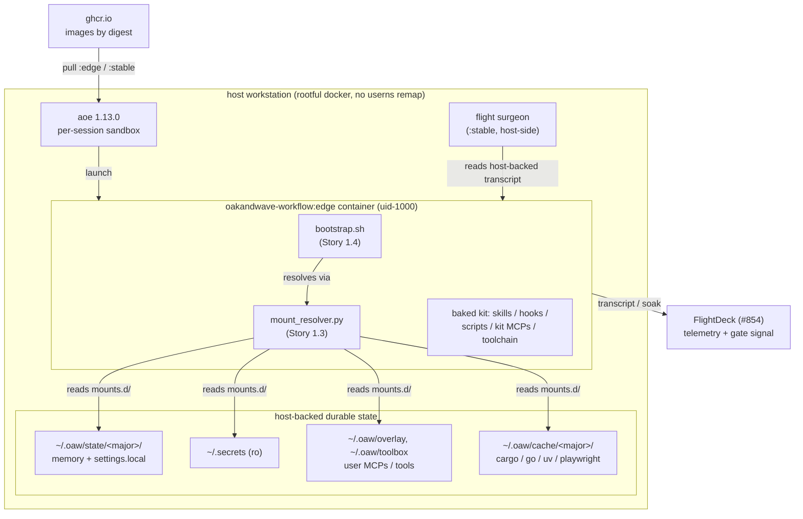
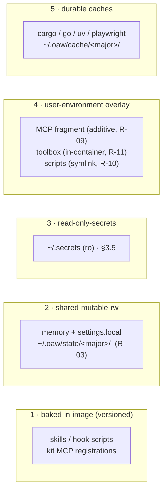

# Architecture — contained workflow

Deliverable **DM-11** (Plan #959, Dev Spec §5.A). Trigger: the system has more
than two interacting components. This document is the component-level map; the
authoritative requirement/design source is
[`docs/contained-workflow-devspec.md`](../contained-workflow-devspec.md) and its
design rationale is `docs/contained-workflow-SKETCHBOOK.md` (merged #958). Where
this doc and the Dev Spec differ, the Dev Spec governs.

## 1. What this system is

The OaW Claude Code kit, packaged as a **versioned container image**
(`oakandwave-workflow:<semver>`) on the AoE sandbox base, so the **image digest
*is* the release** (R-05). The container is a **stateless, disposable RTE**: all
durable state lives on host-backed mounts (R-01), so a broken candidate is
`docker rm`, not an incident. The OaW dev team runs these containers (the
*dogfood ring*) to prove a candidate before the wider fleet adopts the promoted
`:stable` digest.

The design exists to install a boundary that was missing: previously every agent
read one shared `~/.claude`, so one break blocked the whole fleet and a kit could
not be tested without mutating live state (Dev Spec §1.2).

## 2. Component map



**Interacting components** (the >2 that trigger this doc):

| Component | Role | Owner story |
|-----------|------|-------------|
| The image (`Dockerfile` + `Makefile`) | Bakes the kit + toolchain; the digest is the release | 1.1 (#961) |
| me-ful sandbox profile (`sandbox-profile.toml`) | Launches the image as uid-1000 so bind-mount writes are host-owned | 1.2 (#962) |
| **Mount manifest + resolver (`mounts.d/`, `mount_resolver.py`)** | **Declares + resolves the run-layer mounts; enforces the state-taxonomy guards** | **1.3 (#963)** |
| Bootstrap (`bootstrap.sh`) | Runs before the agent: skills-sync, settings merge, secret sourcing, env validation | 1.4 (#964) |
| Secrets mount | ro `~/.secrets` dir mount with mid-session liveness | 1.5 (#965) |
| CI build/push + throwaway-CI ring | Builds, signs, SBOMs, pushes by digest; smokes install-from-zero | 2.1/2.2 |
| Promotion gate | Mechanical conjunction over FlightDeck + CI; retags the tested digest | 2.3 |
| Flight surgeon | Host-side probe reading the host-backed transcript; quarantine + rollback | 3.1/3.2 |
| Container profiles (`profiles.py`) | The two rings + the `oaw.profile` label; the gate-side telemetry filter | 4.1 (#974) |

### 2.1 Container profiles (Story 4.1, R-21/R-22)

The candidate runs in one of **two profiles**, distinguished by the `oaw.profile`
docker label the surgeon and the promotion gate both read:

| Profile | Skills overlay | `oaw.profile` | Candidate? | Role |
|---------|----------------|---------------|------------|------|
| **dogfood** | OFF — image-only | `dogfood` | yes | The real dogfood ring: its runs accrue soak and its breakages trip quarantine — it is what the gate measures. |
| **dev-mode** | ON — a whole-directory bind of the developer's working skills **over** the image skills dir (the R-06 non-promotable exception) | `dev-mode` | **no** | Skill iteration without a rebuild. **Excluded from promotion telemetry** — dev-mode runs/breakages never count toward soak nor trip quarantine. |

> **The overlay REPLACES, it does not merge (#1067).** The bind covers the whole
> image skills dir, so the container sees exactly what the host source contains.
> An empty source therefore yields a container with **no skills at all**, silently —
> `profiles.py` refuses that launch rather than rendering it. Note this is a
> *different* mechanism from `bootstrap.sh`'s skills-sync, which is **image-wins /
> host-fills** from `~/.oaw/.claude/skills`. Two overlay paths with two semantics;
> reconciling them is open work.

`containers/oakandwave-workflow/profiles.py` is the canonical owner of the label
and the candidacy rule. It renders each profile's launch (`launch_spec` — the
`oaw.profile` label plus, for dev-mode only, the skills-overlay `-v` bind, so
"overlay ON" is a real mount and "overlay OFF" its absence), and provides the
**gate-side filter** (`aggregate_gate_signals`) that folds the soak/quarantine
ledgers into `SOAK_HOURS` / `QUARANTINE_COUNT` with every dev-mode record dropped.
The **probe half** of the same filter lives in the flight surgeon
(`scripts/flight-surgeon/surgeon.py`), which excludes dev-mode from
`should_quarantine`; the surgeon re-states the alias table rather than importing
`profiles.py` because it must depend on only the standard library (R-15), and a
lock-step test keeps the two in agreement. The promote wrapper
(`scripts/ci/promote-oakandwave-image.sh`) defaults its `GATE_SIGNALS_CMD` to this
filter when `OAW_SOAK_LEDGER` / `OAW_QUARANTINE_LEDGER` are supplied — so the gate
filters on the label end-to-end.

## 3. The mount manifest (Story 1.3, this story)

Every piece of `~/.claude` state files onto one of the **five layers** of the
state taxonomy (Dev Spec §5.3), and the layer decides how it enters the
container. Layer 1 is *baked in the image* (not a run mount); the other four are
run-layer bind-mounts declared in
[`containers/oakandwave-workflow/mounts.d/`](../../containers/oakandwave-workflow/mounts.d/)
and materialized by
[`mount_resolver.py`](../../containers/oakandwave-workflow/mount_resolver.py).



### 3.1 Layers and their mechanisms

| Layer | Mechanism | Manifest fragment | Requirements |
|-------|-----------|-------------------|--------------|
| Baked-in-image | Built by `./install` in the image; immutable per tag | *(none — in the image)* | R-06, R-09 |
| Shared-mutable-rw | rw bind-mount, **sandbox-scoped** host source | `05-transcripts.toml`, `10-memory.toml` | R-03, R-20 |
| Read-only secrets | ro **whole-dir** bind mount of `~/.secrets` (§3.5, #1090) | `20-secrets.toml` | R-12, R-13, R-14 |
| User-environment overlay | additive / in-container / symlink, by artifact type | `30-user-overlay.toml` | R-09, R-10, R-11 |
| Durable caches | rw bind-mount, major-partitioned | `40-durable-caches.toml` | §5.3 |

### 3.2 The resolver and its guards

`mount_resolver.py` loads the `mounts.d/*.toml` fragments (lexical order),
substitutes `<major>` and `~`, applies the guards, and emits `docker -v` /
aoe `extra_volumes` / JSON for the bootstrap:

```bash
python3 containers/oakandwave-workflow/mount_resolver.py --major 8 --format aoe
```

Each guard **fails loud** — a manifest violation raises `ManifestError`, never
degrades silently (the D7 assertion-liveness discipline):

- **R-03 — sandbox-scoped memory.** The one rw seam into shared durable state
  (memory) must resolve under `~/.oaw/state/<major>/` and must **never** touch
  the live-fleet `~/.claude` tree. Pointing it at `~/.claude/projects/*/memory`
  would hand a broken `:edge` candidate write access to the live fleet's memory —
  the exact shared-mutable-with-live-fleet disease this design cures, at the one
  rw seam. The `<major>` segment partitions the namespace so mixing majors is
  isolated, not corrupting (R-20). This is the story's canonical oracle
  (`test_memory_source_scoped`).
- **R-10 — the libc boundary.** A compiled binary in the user overlay is
  installed *in* the container (`install = "in-container"`), never symlinked
  across the host/container libc boundary — a host ELF fails on `.so`/interpreter
  mismatch in a differently-built container. Scripts and config may symlink. The
  resolver rejects a `compiled-binary` declared `symlink`; the `is_compiled_binary`
  file classifier (ELF magic vs `#!` shebang) is the runtime primitive the
  bootstrap uses to route each `~/.local/bin` entry (measured: ~154 shebang
  scripts symlink-safe, ~26 ELF must install in-container).
- **R-09 / R-11 — additive composition.** Third-party / user MCP servers compose
  as an *additive fragment* (`compose = "additive"`) via the scoping already
  governed by [`docs/mcp-scoping.md`](../mcp-scoping.md) — never by mounting the
  whole `~/.claude.json` (which carries far more than MCP config). The kit's own
  MCP registrations (`disc-server`, `sdlc-server`, `wtf-server`, `nerf-server`,
  `discord-watcher` — see `mcps.json`) are **baked at stable image paths**;
  baking kills the dangling-registration bug (a stale path to a moved binary).
  The discretionary-tool toolbox (R-11) is a durable, in-container-materialized
  mount decoupled from the kit release.

### 3.3 settings.json split

`settings.json` straddles versioned and shared, so it is **split** (Dev Spec
§5.3): the image ships `settings.json` (hook wiring — versioned, because hook
registrations point at script paths that live in the image), and the
`10-memory.toml` fragment bind-mounts `settings.local.json` (permissions / env /
identity — the genuinely shared knobs). Claude Code merges the two.

### 3.4 PATH precedence

Kit binaries (from the image) win over the user overlay on `PATH`, so the RTE
stays authoritative — the same digest-determines-behavior rule that the promotion
gate depends on (Dev Spec §5.3).

### 3.5 Secrets: the read-only mount (Story 1.5)

Secrets enter as **named, read-only, single-file bind-mounts**
([`20-secrets.toml`](../../containers/oakandwave-workflow/mounts.d/20-secrets.toml))
landing under `/home/ubuntu/.secrets` — the default the bootstrap's
`OAW_SECRETS_DIR` already resolves (Dev Spec §5.5). Story 1.5 mounted the *whole*
dir; #1061 replaced that with named files, because the host dir spans both sides
of the OaW/Analogic IP boundary and the kit consumes one entry of ~80.

- **Never baked (R-12).** The image *is* the release: it ships to every ring and
  registry, so a secret baked into any layer would leak with the digest. Secrets
  are provided **only** through this runtime mount; the image `RUN` deliberately
  tolerates `check-deps`' missing-token advisory rather than baking the tokens
  (Dockerfile §"Bake the kit"). The resolver enforces the ro half — a fragment
  fat-fingered to `mode = "rw"` raises `R-12 VIOLATION` (`test_secrets_rw_fragment_is_rejected`).
- **Live mid-session (R-13), with one sharp limit.** A bind *is* the host file, so
  an **in-place** rewrite is visible inside the running container with no restart.
  An **atomic replace** (`mv`, `sops`, most editors' save-by-rename) is NOT: a file
  bind binds the *inode*, so the container stays pinned to the old one, silently,
  until it is recreated. Rotate in place, or recreate. Adding a *new* secret also
  needs a new mount — deliberately, since that is what keeps an unrelated
  credential from entering a container's reach.
- **Fail-loud on a missing required secret (R-14).** The required set is declared
  via `OAW_REQUIRED_SECRETS` in the mounted `.env` (template:
  [`secrets-env.example`](../../containers/oakandwave-workflow/secrets-env.example)),
  **not** a `required.manifest` file — with the whole-dir mount gone, a manifest in
  `~/.secrets` would be unmounted, leaving R-14 validating nothing while appearing
  configured. bootstrap warns loudly when neither is declared.

**Consumer split (the load-bearing nuance).** The mount is live, but *how* live
depends on how a consumer reads a secret:

| Modality | Source | Liveness |
|----------|--------|----------|
| **path** | a loose file `~/.secrets/<NAME>`, read on demand | **fully live** (R-13) — the consumer re-reads the file |
| **env** | `~/.secrets/.env`, sourced once by `bootstrap.sh` at boot | snapshot-at-boot — a value added *after* boot reaches only path consumers until the next re-source |

> This row described an *intent* until #1076: nothing invoked `bootstrap.sh`, so
> `.env` was never sourced in a running container and no env-modality consumer
> ever saw a value. See §3.6 for the wrapper that now makes it true.

So **prefer file-path consumers** where liveness matters: `.env` is convenient
but its values are frozen at the boot source. Loose files stay path-modality and
are **never auto-exported** (SKETCHBOOK D6), which is also why they stay live.

**Blast radius — REOPENED deliberately (#1090).** #1061 replaced the whole-dir
mount with named single files, citing the OaW/Analogic IP boundary. That scoping
was reversed on an operator decision; the reasoning is recorded so nobody
restores it on the retired rationale:

> "they all get used by agents one time or another. I don't want to curate which
> agents will need what access via who's tokens. I just want every agent to have
> access to all those tokens like they do today"

Two corrections to the original argument: **mounted is not baked** — R-12 keeps
secrets out of every image layer and these are *runtime* binds, so "an OaW image
on a public registry" was never an argument against a runtime mount — and **the
trust model is unchanged**, since every *host* agent already reads all ~80
entries. Per-agent curation bought no security the fleet does not already grant,
and #1089 showed it merely moves the blocker to whoever needs the next credential.

**Availability and inheritance are separate axes, and only availability widened.**
Everything stays **path-modality**: a file must be deliberately opened, whereas an
environment variable is inherited by **every child process**. `OAW_SECRET_ENV`
remains limited to `CLAUDE_CODE_OAUTH_TOKEN` (§3.6); `gh` and `glab` credentials
are written to files (§3.6.1). MCP servers follow the same rule — `disc-server`
and `discord-watcher` take `DISCORD_TOKEN_FILE`/`DISCORD_TOKEN_PATH`, **pointers,
not values**. A guard test enforces that the env-projection list does not grow.

Side benefit for R-13: a credential added on the host now appears in every running
container immediately, where before it needed a new mount fragment and a relaunch.

### 3.6 Agent authentication, and how bootstrap gets invoked at all (#1076)

**Why a containerised agent needs its own credential.** aoe mounts its own
credentials to `/root/.claude`, but this image runs as `ubuntu` by design
(R-04/TC-2, so bind-mount writes are host-owned). `/root` is mode `700`, so the
agent never sees them. Without a credential of its own it boots, clears the
theme prompt, and halts on `Select login method:` — forever, with no error and no
exit. **An unattended agent parked on a login menu is indistinguishable from an
idle one**, which is why this failed silently for as long as it did.

**The mechanism.** `claude-code-oauth-token` is mounted as a named read-only file
(§3.5), declared in `deps.json`, and projected into the environment by
`bootstrap.sh` via `OAW_SECRET_ENV` in the mounted `.env`:

```sh
OAW_REQUIRED_SECRETS="claude-code-oauth-token discord-bot-token"
OAW_SECRET_ENV="CLAUDE_CODE_OAUTH_TOKEN=claude-code-oauth-token"
```

Both values **must be quoted** — `.env` is `source`d, so an unquoted value
containing a space is not a list, it is `VAR=first` prefixed to a command named
`second`, and the boot dies with `command not found`.

**This is a deliberate exception to the pointers-never-values rule** in §3.5.
That rule exists because an environment variable is inherited by every child
process, which matters for the Discord bot token — a credential granting access
to a system the agent's children have no business touching. An agent's *own* auth
token is different in kind: a child that steals it gains exactly what the agent
already has. **Do not project third-party credentials this way.**

**How bootstrap runs — the part that was missing entirely.** aoe never executes an
entrypoint. It starts the image with `sleep infinity` as PID 1 and then
`docker exec`s `claude` as a **separate** process (measured: PID 1 =
`sleep infinity`, agent = PID 13 with **PPID 0**). Nothing in that path ever
invoked `bootstrap.sh`, so until #1076 *every* bootstrap phase — skills-sync,
settings merge, secret projection, R-14 validation — was inert in production
while its unit tests passed, because they drive the script directly by
subprocess. The env-modality row in §3.5 ("sourced once by `bootstrap.sh` at
boot") described an intent, not a behaviour.

The seam is therefore
[`claude-entrypoint.sh`](../../containers/oakandwave-workflow/claude-entrypoint.sh),
installed over the `claude` name, which **sources** bootstrap and then `exec`s the
real CLI (moved aside to `claude-real`):

- **Sourced, not run.** Environment flows down, never up. A child process would
  export the token into itself and exit, leaving the agent with nothing and every
  log looking healthy — the same end state as the original bug.
- **Fail-loud for free.** `bootstrap.sh` ends in `exit 1` when `FATAL_COUNT > 0`,
  which aborts the wrapper before the `exec`. "Refusing to hand off to the agent"
  is only true because the `exec` never happens.
- **Everything on stderr.** The wrapper's fd 1 *is* the agent's fd 1, so a single
  bootstrap line on stdout corrupts `claude -p --output-format json`.
- **Every reachable `claude` is wrapped, and that is asserted, not assumed.**
  `docker exec` resolves against the *image's* PATH, which reaches the base
  image's `/root/.local/bin/claude` before `/usr/local/bin`, so wrapping one path
  is not enough — the first cut of this fix shipped inert for exactly that reason.
  [`assert-no-claude-bypass.sh`](../../scripts/ci/assert-no-claude-bypass.sh)
  walks PATH at **build time** and fails the build if any reachable `claude` is
  not the wrapper. It currently finds three.
- **Escape hatch.** `OAW_SKIP_BOOTSTRAP=1` starts the agent unbootstrapped, loudly,
  so a container with a broken bootstrap is still repairable.

**Verification is behavioural, not declarative** — configuration existing is not
the contract. The check is a real agent in a real container returning a real
answer:

```
$ docker exec -u ubuntu <c> claude -p 'reply with exactly: AUTH_OK'
AUTH_OK
```

with nothing else on stdout, the agent process showing as `claude-real` (proof the
wrapper ran), and `CLAUDE_CODE_OAUTH_TOKEN` present in `/proc/<agent>/environ`.

### 3.5.1 The CLI does not necessarily read `$HOME` (#1085)

**aoe launches with `CLAUDE_CONFIG_DIR=/root/.claude`** and mounts its own config
there. The image runs as `ubuntu` (R-04/TC-2) and `/root` ships `0700`, so the
runtime user could not *traverse* it — every path underneath was EACCES even
though `/root/.claude` itself is ubuntu-owned and readable.

One unobserved variable produced five distinct production symptoms:

| symptom | mechanism |
|---|---|
| Settings Error at startup | `$CLAUDE_CONFIG_DIR/settings.json` unreadable — and the CLI skips files with errors **entirely**, losing every hook |
| zero MCP servers | `./install` registers into `$HOME/.claude.json` at build time; the CLI reads `$CLAUDE_CONFIG_DIR/.claude.json` |
| onboarding wizard every launch | §3.7's state written to `$HOME/.claude.json`, never read |
| trust prompt per workspace | same file |
| `401 … token has been revoked` | a stored `.credentials.json` **outranks** `CLAUDE_CODE_OAUTH_TOKEN`; the stale one was used while the mounted token returned **HTTP 200** |

**The config file is not simply "under the config dir" in both cases**, and
assuming so silently relocates the native config:

```
CLAUDE_CONFIG_DIR set   ->  $CLAUDE_CONFIG_DIR/.claude.json
unset                   ->  $HOME/.claude.json      (home ROOT)
```

**Credential precedence is shared *by design*.** A stored `.credentials.json` in
the shared config dir beats the mounted token, and that is what the operator
wants: the fleet is rate-limited roughly weekly and rotates through several
accounts, so **one login must reach every agent** — isolating credentials would
cost one interactive login *per agent* per rotation. Bootstrap therefore does not
override or delete it; it **reports** it, with its path and its precedence, so a
401 arrives with a filename rather than a wrong accusation.

**Hook paths must resolve in this namespace.** The effective `settings.json`
under aoe is the operator's *host* settings, carrying host absolute paths.
Production hit `/home/bakerb/.local/share/wtf-server/hooks/wtf-post-tool-use.sh:
not found` — a **category error**, not a preference conflict: a host path cannot
resolve in a different filesystem namespace. Bootstrap validates configured hook
paths at boot rather than letting them fail at first tool use. It does **not**
blanket-rewrite `$HOME` prefixes: measured on a real host, only 1 of 4 host paths
was a hook; the rest were workspace references that do not map (workspaces mount
at `/workspace/<name>`), so rewriting them would manufacture plausible-looking
paths that do not exist.

**Verification must go through aoe.** #1076, #1079 and #1082 were each verified
green and each partially bypassed in production, because every verification used
`docker run` with the profile's `extra_volumes` — reproducing the **mounts** but
not the **launcher**. `scripts/ci/aoe-preflight.sh` launches through aoe and
asserts ten behaviours from inside the container; it was proven able to fail by
running it against the unfixed image first. **A harness that reproduces the
inputs but not the invoker is not a rehearsal.**

#### Known, deliberate gap: the settings split does not survive aoe

This fix reconciles `.claude.json` (MCP registrations, onboarding, trust) into the
effective location. It does **not** reconcile `settings.json`, and the honest
consequence is that under aoe **the image's baked hook wiring (§3.3, R-06
"versioned with the release") and the bind-mounted `settings.local.json` (R-03
shared knobs) are both unread.** The CLI reads the operator's host settings
instead.

That contradicts §3.3 and is stated here rather than left to be discovered.
`aoe-preflight.sh` asserts the effective settings are *readable* and that every
configured hook *resolves*; nothing yet asserts the kit's own hooks are
**present**. Resolving it means either merging the image's `hooks` block the way
`mcpServers` is merged, or accepting that hook wiring is operator-owned under aoe
and dropping the R-06 claim for it. Deferred deliberately: it is a contract
change, not a bug fix, and shipping it inside a five-symptom incident fix would
bury it.

### 3.6.1 GitHub credential — file modality, deliberately not env (#1082)

Authentication to Anthropic gets an agent to a prompt; it does not let it *land
work*. Without a GitHub credential a containerised agent cannot push, open a PR,
merge, or run `/scpmmr` — it can think but not ship. Caught in cut-over
pre-flight, where everything else passed: 39 skills present, all five MCP
binaries executable, transcripts and memory host-visible, workspace writes
host-owned, secrets scoped to 2 of ~80.

**The host authenticates `gh` via `GH_TOKEN`, and copying that would be wrong.**
An environment variable is inherited by **every child process**, and the only
working GitHub credential on this host carries:

```
admin:enterprise, admin:org, admin:org_hook, delete_repo, delete:packages,
admin:public_key, admin:ssh_signing_key, audit_log, workflow, repo, …
```

The `CLAUDE_CODE_OAUTH_TOKEN` exception in §3.6 was argued **narrowly**: that
token *is* the agent's own identity, so a child that steals it gains nothing the
agent does not already have. An org-admin PAT does not meet that bar, so it is
not projected into the environment. Instead `bootstrap.sh` materialises `gh`'s
own credential file:

```
~/.config/gh/hosts.yml   (mode 600, written under umask 077)
```

Only `gh` reads it, and nothing inherits it. Verified in a live container:
`gh api user` returns the expected login while `GH_TOKEN` is **absent** from the
agent's environment — both halves asserted, because the first without the second
would be the leak this design exists to avoid.

An operator-placed `hosts.yml` already containing an `oauth_token` is left alone.
A missing or empty secret **warns and boots** — an agent without GitHub access is
degraded but useful, and the wrapper sources bootstrap, so a fatal here would
mean no agent at all.

`github-pat` is deliberately **not** in `OAW_REQUIRED_SECRETS`. Declaring it
required would make R-14 `fatal` one function earlier, so the documented
degraded-but-booting mode would be unreachable for anyone using the shipped
template — the code, the template and this paragraph have to agree, and warn is
the one that matches the intent.

**Authenticating `gh` is not enough — `git` is a separate client.** `hosts.yml`
authenticates the CLI; `git push` never reads it, and `gh pr create` shells out
to `git push`. The first cut of this fix verified `gh api user`, declared
victory, and would have shipped an agent that could call the API and still not
land a commit:

```
$ git push --dry-run origin HEAD
Host key verification failed.
fatal: Could not read from remote repository.
```

Repos are cloned with `git@github.com:` origins. **The reason git failed was
not a missing credential** — see the correction in §3.6.2. An earlier version of
this section stated the container deliberately had no `~/.ssh`; that was inference
from the §3.5.1 permissions bug, and the URL-rewrite remedy it justified has been
removed. Retained here for the record:

- `credential.https://github.com.helper = !gh auth git-credential`
- `url.https://github.com/.insteadOf = git@github.com:`

Only together do they work: the helper supplies the token, the rewrite makes the
SSH remote use HTTPS so the helper is consulted at all.

**Timing note:** the credential is written when *bootstrap* runs, i.e. when the
agent starts. A bare `docker exec … gh` before any agent has run will find no
credential — that is expected, not a defect, and it is how the first version of
this check produced a false alarm.

### 3.6.2 SSH parity — the keys are provided on purpose (#1089)

aoe mounts the operator's `~/.ssh` to `/root/.ssh`: keys **and** a host→identity
config. Agents use them constantly — git over SSH for both forges, and
troubleshooting remote installs (blueshift, perkollate, `agent-smith-ca`), where
no API token substitutes.

**They were mounted and invisible.** The agent runs as `ubuntu` with
`HOME=/home/ubuntu`, so `ssh` looked in an empty `/home/ubuntu/.ssh`, fell back to
default identity names, and failed `Permission denied (publickey)`. Before §3.5.1
made `/root` traversable it could not have worked at all.

`ensure_ssh_parity` links `~/.ssh` to the mounted directory. It is idempotent; it
clears `ssh`'s own `known_hosts` scratch dir — which appears silently the first
time `ssh` runs and made a naive `ln -s` land *inside* it, reporting success while
the keys stayed hidden; and it **refuses loudly** to replace a real `~/.ssh`,
because destroying an operator's private keys is unrecoverable.

Measured after: `ssh -T git@gitlab.com` → *Welcome to GitLab*, and
`git ls-remote git@…` succeeds on **both** forges, with **no** URL rewriting.

> **This corrects #1082.** That fix reasoned from `gh api user` passing while
> `git push` failed that git needed HTTPS+token, and added
> `url.https://github.com/.insteadOf` plus a credential helper. The diagnosis was
> half right — git transport *was* broken — and the remedy was wrong: git failed
> because the keys were unreachable, not because a credential was missing. The
> rewrite **changed** behaviour rather than restoring it, and bypassed keys
> provisioned deliberately. All URL rewriting is removed; a test pins its absence.
>
> **The governing principle**, and why this matters beyond one bug: *the container
> is not a reduced-privilege environment.* It exists so agents keep working while
> the kit is in flux, doing exactly what a host session does. A change that makes
> the container **differ** from the host — however defensible in isolation — is a
> regression against that goal, not a hardening.

**Git transport is per-forge, because the host treats them differently.** Verified
against the operator's `~/.gitconfig`: github has
`url.https://github.com/.insteadof git@github.com:` plus
`credential.https://github.com.helper !gh auth git-credential`, and gitlab has **no**
rewrite. So a host session uses **HTTPS+PAT for github** and **SSH for gitlab**, and
the container now does the same.

An earlier draft of this section removed the github rewrite on the premise "the host
uses SSH for git" — true for gitlab, false for github, generalised from one forge to
both. That made the container authenticate github git as the SSH *key* identity while
the host uses the *PAT* identity: different credential, audit trail and effective
permissions. Restored, with a test pinning both halves.

### 3.7 First-run onboarding state (#1079)

Authentication alone does not get an agent to a prompt. A container that has
never run the CLI walks the first-run wizard — theme → login menu → trust folder
— and an agent parked on a wizard is operationally identical to one parked on a
login menu: it looks idle forever.

**The contract is exactly two keys in `~/.claude.json`**, derived empirically
against the real image rather than guessed. Each candidate was run repeatedly,
because single runs proved non-deterministic and one early conclusion was drawn
from a container that still carried a previous probe's mutations:

| config | outcome |
|---|---|
| `hasCompletedOnboarding` + trust for cwd | **reaches the prompt** (3/3) |
| `hasCompletedOnboarding` alone | trust dialog (2/2) |
| `theme` + trust, no `hasCompletedOnboarding` | theme picker |

Two results are worth stating because they contradict the obvious guess:

- **`theme` is not part of the contract.** `hasCompletedOnboarding` covers the
  theme step. Neither is `lastOnboardingVersion` — which is fortunate, since
  baking a version string would drift on every base-image CLI bump.
- **`--dangerously-skip-permissions` does not bypass the wizard** (measured), so
  the agent's own flags cannot be relied on to clear it.

**Why bootstrap does this at boot rather than the image baking it.** Trust is
recorded **per project**, keyed on the working directory — trust for
`/home/ubuntu` while the agent runs in `/workspace/<name>` still shows the
dialog. The sandbox path varies per session, so there is no build-time value to
bake. `bootstrap.sh` uses its own `$PWD`, which is the agent's cwd precisely
because the wrapper **sources** it in the agent's process (§3.6).

The write merges rather than replaces — the same file carries the baked MCP
registrations — under an exclusive `flock` held across the whole
read-modify-write, and it serialises the JSON *fully* before touching the file.
Both matter because bootstrap now runs on **every** `claude` invocation: unlocked,
two interleaved runs lose an update, and the lost update is precisely this bug
(A reads, B reads, A writes `trust[a]`, B writes without it, agent A parks on the
dialog forever). `open(..., "w")` would truncate at open and stream, leaving a
window in which an interrupted write destroys the MCP registrations.

It writes **in place** (same inode) rather than write-then-rename. Note the
reason: it preserves ownership and mode, which protects an `ubuntu`-owned file
when bootstrap runs as root. It is *not* because this file might become a bind
mount — `mount_resolver.py` explicitly **rejects** any mount whose source
basename is `.claude.json`, and `test_mounts.py` locks that in, so the
bind-mount rationale (given in an earlier draft of this section) is void. The
distinction matters to whoever is next tempted to "simplify" the write.

**Auto-trust is a real decision, and it stays reversible.** It is correct here
for exactly one reason: **the operator chose this mount** when launching the
sandbox. `OAW_NO_AUTO_TRUST=1` restores the prompt, and that opt-out clears
onboarding **without** granting trust, so it is usable rather than all-or-nothing.

It is **not** justified by the agent already running
`--dangerously-skip-permissions`, which an earlier draft claimed. Those gate
different things: skip-permissions removes tool-use approval, whereas folder
trust governs whether the workspace's *own* project-scoped config — `.mcp.json`,
project hooks, project `settings.json` — is loaded and executed. Auto-trust
therefore **adds** unprompted execution of repo-supplied config rather than being
subsumed by a flag the agent already carries. Same call either way for an
operator-chosen mount, but do not reason from the flag.

Verified behaviourally on the built image: a fresh container with no manual
config, in an arbitrary workspace path, reaches a prompt 3/3; setting
`OAW_NO_AUTO_TRUST=1` brings the trust dialog back, which is the positive control
proving the mechanism is doing the work.

## 4. Boundaries and invariants

- **Stateless-container invariant (R-01/R-02).** The container filesystem is
  disposable; everything durable is a host-backed mount, so recreate loses no
  state. The resolver's job is to make every durable mount explicit and guarded.
- **me-ful ownership (R-04).** The container runs as uid-1000 `ubuntu`, so
  bind-mount writes land host-user-owned (`bakerb`). Delivered by the image
  `USER` (Story 1.1) + the isolated aoe profile (Story 1.2).
- **Portability (PC-3).** No OaW-org specifics (cephfs paths, secret contents)
  are baked into the image; org infrastructure is a run-layer overlay only. The
  manifest's host sources are the run-layer seam.
- **Major-partitioned namespace + within-major compat (R-18/R-20).**
  `~/.oaw/state/<major>/` and `~/.oaw/cache/<major>/` are keyed by kit major, so
  mixing majors is isolated, not corrupting (R-20). *Within* a major, all minors
  resolve the ONE namespace and shared-state changes are **additive +
  forward-tolerant** (R-18): a new minor may add a field but never drop or
  redefine one, so an updated and a not-yet-updated agent interoperate over the
  same tree — the old reader ignores fields it does not know; the new reader
  defaults fields the old writer never wrote. A breaking shared-state change is
  therefore a major bump (which lands in a fresh namespace), not a silent minor —
  the SemVer compatibility contract (Dev Spec §5.8), and the reason no shared-state
  migration engine is built (§1.5). Canonical oracle:
  `tests/contained-workflow/test_compat.py` (`test_namespace_partition` +
  `test_within_major_change_is_additive_and_forward_tolerant`).

## 5. Open items carried by this component

- **Isolation under the full custom mount set** (Dev Spec §5.N#3, MV-02): the
  "live `~/.claude` is not exposed" result was one default-`--sandbox`
  observation; it is confirmed against the full manifest in MV-02 (closing story
  4.3). The resolver's R-03 guard is the *static* half of that assurance; MV-02
  is the runtime half.
- **Secrets blast-radius** (Dev Spec §5.5, §5.N; documented in §3.5) — **closed
  by #1061.** The whole-dir mount is gone; the `read-only-secrets` layer now
  carries named single-file mounts, so a container sees only the secrets it
  declares. This was the slot the taxonomy reserved for a scoped mechanism, and
  it needed no new machinery — with the kit consuming one secret of ~80, naming
  it was cheaper than building a scoping engine. Revisit only if the
  container-required set grows beyond a handful.
- **AoE bootstrap seam** (Dev Spec §5.N#5): whether aoe respects the image
  `ENTRYPOINT` or `docker exec`s the agent directly determines where the
  bootstrap (Story 1.4) hooks the resolver in. The resolver is seam-agnostic — it
  is a pure function from `(manifest, major, home)` to a mount set.

## 6. Verification

| Requirement | Verified by |
|-------------|-------------|
| R-03 sandbox-scoped memory | `tests/contained-workflow/test_mounts.py::test_memory_source_scoped`; IT-03; MV-02 |
| R-09 MCP additive scoping | `test_mounts.py::test_mcp_composes_additively`; IT-03 |
| R-10 binaries in-container | `test_mounts.py::test_compiled_binary_installs_in_container`; IT-01/IT-03 |
| R-11 declarative toolbox | `test_mounts.py::test_toolbox_is_durable_in_container`; IT-03 |
| R-12 secrets never baked / ro | `test_secrets.py::{test_secrets_mount_is_readonly,test_secrets_rw_fragment_is_rejected,test_secrets_never_baked_into_image}`; `test_secrets_readonly` (IT-02) |
| R-13 secret liveness | `test_secrets.py::test_secrets_readonly` (IT-02); MV-07 |
| R-01 stateless / host-backed | this doc (DM-11); IT-03; MV-02 |
