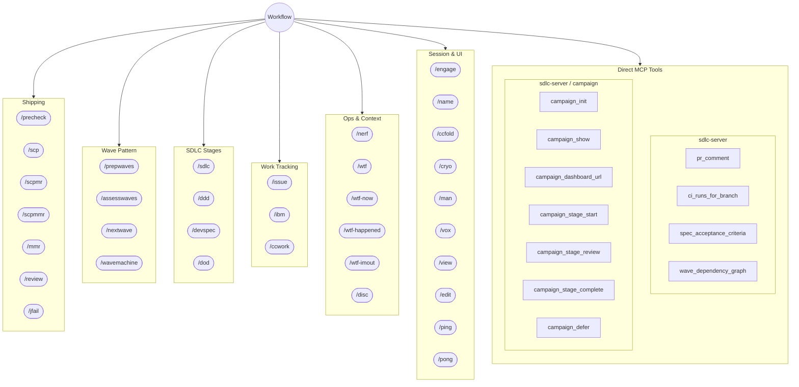

# Tool & Skill Map

Everything surfaced to the user — skills invoked via `/command` and MCP tools called directly.

---

## Reverse Index: Skill -> MCP Tools

What each skill calls under the hood.

| Skill | MCP Tools |
|-------|-----------|
| `/assesswaves` | `spec_validate_structure`, `spec_dependencies`, `wave_topology` |
| `/ccwork` | `spec_get`, `work_item` |
| `/ddd` | `ddd_locate_domain_model`, `ddd_locate_sketchbook`, `ddd_summary`, `ddd_verify_committed` |
| `/devspec` | `devspec_locate`, `devspec_summary`, `devspec_approve`, `devspec_finalize`, `devspec_parse_section_8`, `devspec_verify_approved` |
| `/disc` | `disc_send`, `disc_read`, `disc_list`, `disc_resolve`, `disc_create_channel`, `disc_create_thread` |
| `/dod` | `dod_load_manifest`, `dod_verify_deliverable`, `dod_run_test_suite`, `dod_check_coverage` |
| `/ibm` | `ibm` |
| `/issue` | `work_item` |
| `/jfail` | `ci_run_status`, `ci_failed_jobs`, `ci_run_logs` |
| `/mmr` | `pr_status`, `pr_diff`, `pr_wait_ci`, `pr_merge`, `ci_wait_run` |
| `/nerf` | `nerf_status`, `nerf_mode`, `nerf_darts`, `nerf_budget`, `nerf_scope` |
| `/nextwave` | `spec_validate_structure`, `wave_preflight`, `wave_planning`, `wave_flight`, `wave_flight_plan`, `wave_flight_done`, `wave_close_issue`, `wave_record_mr`, `wave_review`, `wave_reconcile_mrs`, `wave_complete`, `wave_waiting`, `wave_defer`, `wave_next_pending`, `wave_previous_merged`, `wave_show`, `flight_overlap`, `flight_partition`, `commutativity_verify`, `pr_merge`, `pr_wait_ci`, `drift_files_changed`, `drift_check_path_exists`, `drift_check_symbol_exists` |
| `/precheck` | `ibm`, `spec_validate_structure`, `disc_send` |
| `/prepwaves` | `epic_sub_issues`, `spec_validate_structure`, `spec_dependencies`, `wave_compute`, `wave_topology`, `wave_init` |
| `/review` | `pr_diff`, `pr_files` |
| `/scp` | `ibm`, `pr_list`, `pr_create` |
| `/scpmr` | *(delegates to /scp)* |
| `/scpmmr` | *(delegates to /scp + /mmr)* |
| `/sdlc` | `ibm`, `work_item` |
| `/wavemachine` | `wave_show`, `wave_previous_merged`, `wave_next_pending`, `wave_health_check`, `wave_ci_trust_level`, `wave_waiting` |
| `/wtf` | `wtf_freshell` |
| `/wtf-happened` | `wtf_happened` |
| `/wtf-imout` | `wtf_imout` |
| `/wtf-now` | `wtf_now` |

### No MCP tools (pure orchestration / UI)

`/ccfold`, `/cryo`, `/edit`, `/engage`, `/man`, `/name`, `/ping`, `/pong`, `/view`, `/vox`

---

## Summary

| Server | Total Tools | Skill-wrapped | Direct (no skill) |
|--------|-------------|---------------|-------------------|
| sdlc-server | 66 | 55 | 11 |
| disc-server | 6 | 6 | 0 |
| nerf-server | 5 | 5 | 0 |
| wtf-server | 4 | 4 | 0 |
| **Total** | **81** | **70** | **11** |
